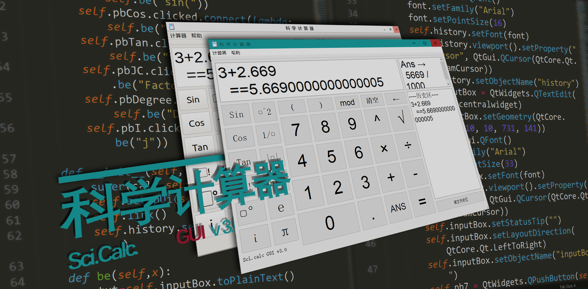
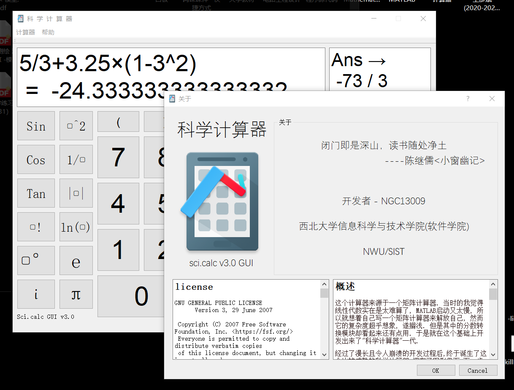

# 科  学  计  算  器

## 升级带有图形界面版本,目前不是很完善.

经过了漫长且令人崩溃的开发过程后,终于诞生了新版的科学计算器,拥有了图形界面,下一步升级计划是添加更多功能,优化体验.

准确来说现在这个是测试版,因为功能差得远.后续完善.

## 作者备注

这个项目呢,是我自己学习qt用的练手产品,我不喜欢做题,喜欢从实践来到实践去,于是自己就想着开发个计算器,顺便就学习了PyQt5了.我个人觉得通过一个实际的项目学习起来新知识更快更好更有趣(虽然导致代码结构混乱).这个项目作为计算器并不是一个很好的例子(因为没有速度,没有精确度,没有多线程,体积大,不好用),但是作为qt的练手项目,我个人觉得很合适,可以通过这个掌握qt的基本用法,熟练一个程序的生成过程.虽然没用上一些高级技巧,但是作为入门产品够了.(等到我学习到了多线程的时候,估计就可以支持多线程了)

## 用处

用于科学计算,可以输入一个表达式或小数或无限循环小数或分数,输出一个最简分数,用于作业的偷懒或科学计算.或者没有计算器时.

## 使用说明书

内置

## 下一步的升级计划

支持更多的高级数学运算,支持根式化简,修复BUG,支持解方程,更多函数.

## 更新日志

1. v1.0 frac诞生
2. v1.1 更名为"输出数学分数形式",修复bug
3. v1.2 修复 IEEE 754 标准导致的一些玄学错误,修复bug
4. v1.3 改善输出格式为统一假分数格式,修复bug
5. v1.5 将程序写为插件形式,可以作为其他程序的辅助,修复bug
6. v1.6 改变界面外观,修复bug
7. v1.8 提高运行效率,优化代码结构,修复bug
8. v2.0 支持表达式输入,程序长得更像计算器了,修复bug
9. v2.1 添加对整数的支持,修复bug
10. v2.2 修复了一大堆bug
11. v2.3 修复了闪退bug
12. v2.4 添加对负数的支持,修复bug
13. v2.5 添加了报错功能,再也不会一言不合的闪退,制造bug,修复bug
14. v2.6 改善了交互界面的合理性,修复bug
15. v2.7 添加了一行说明文字
16. v2.8 改善了整数的输出形式,修复bug
17. v2.9 增加了退出指令"exit",让习惯shell和bash的人更爽.升级了说明书内容.改名字为"科  学  计  算  器".
18. 图形版v1.0诞生!
19. 升级到图形版v2.0, 改善了界面美观程度,意外的没有bug
20. v3.0,支持复数和更多运算功能,改善了分数输出格式.重新引入了 IEEE 754 标准导致的一些玄学错误.
21. v3.0 beta 升级出来了帮助,关于的界面,更加像一个程序了.
22. 收拾了一下开发目录, 重命名了文件名, 使得人类能看懂.

### 算法代码制造生产调试测试上线一条龙:

NGC13009;